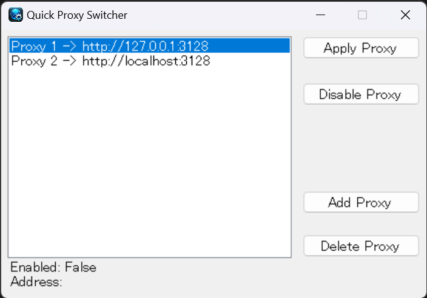

# Quick Proxy Switcher

## Overview(概要)

Quick Proxy Switcher is a tool for Windows that allows easy switching of proxies.

Quick Proxy Switcherは、簡単にProxyを切り替える事ができるwindows用のツールです。

## Prerequisites(前提条件)

- Requires .NET Framework 4.7.2 to be installed.
- .NET Framework 4.7.2がインストールされている必要があります。

## Installation(インストール方法)

1. Download the latest release from the GitHub repository.

2. Unzip the downloaded file and launch the executable.

1. 最新のリリースをダウンロードします。

2. ダウンロードしたファイルを解凍し、実行ファイルを起動します。

## Usage(使い方)

Press the "Add Proxy" button to add proxy settings.

To apply a desired proxy setting, select it and press "Apply Proxy", or simply double-click the setting to have the proxy applied.

Pressing the "Disable Proxy" button will disable the proxy settings.

「Add Proxy」ボタンを押下し、プロキシ設定を追加してください。

適用したいプロキシ設定を選択して「Apply Proxy」を押下、もしくは設定をダブルクリックするとプロキシが反映されます。

「Disable Proxy」ボタンを押下するとプロキシ設定が解除されます。

## License(ライセンス)

This application is distributed under the MIT License.

このアプリケーションはMITライセンスの下で配布されています。

